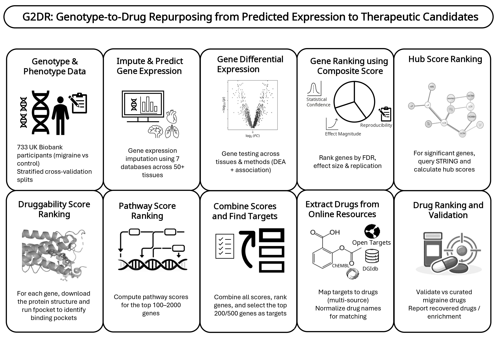

# G2DR: A Genotype-First Framework for Genetics-Informed Target Prioritization and Drug Repurposing

## Graphical Abstract
 
 
---
## What G2DR Does (and Doesn't Do)
 
G2DR is a **modular hypothesis-generation framework**, not a definitive therapeutic predictor. It is designed for genotype-first settings where biobank-scale genotype and phenotype labels are available, but disease-specific transcriptomics are absent or sparse.
 
The framework:
- Imputes genetically regulated expression across 7 prediction resources (MASHR, JTI, UTMOST, UTMOST2, EpiXcan, TIGAR, FUSION) spanning ~50 GTEx tissues
- Tests differential expression using 8 statistical methods under stratified cross-validation
- Ranks genes by a reproducibility-weighted composite score derived exclusively from training and validation data
- Annotates targets with pathway, network hub, and druggability evidence
- Maps prioritized genes to compounds via Open Targets, DGIdb, and ChEMBL
 
**Important caveats:** TWAS-style signal can be confounded by linkage disequilibrium and co-regulation. Prioritized genes should be interpreted as genetically supported candidates, not confirmed causal effector genes. Drug mapping does not resolve causal directionality or clinical viability.

---

## Expression Weight Models
 
| Model | Source | Description | Gene–Tissue Pairs |
|-------|--------|-------------|-------------------|
| MASHR | [Zenodo](https://zenodo.org/records/7551845) | Multivariate adaptive shrinkage for cross-population transcriptome prediction | ~686,000 |
| UTMOST/JTI | [Zenodo](https://zenodo.org/records/3842289) | Joint-tissue imputation framework for TWAS and Mendelian randomization | ~539,000 |
| EpiXcan | [Synapse](https://www.synapse.org/Synapse:syn52745052) | Transcriptome imputation incorporating epigenomic annotations | ~343,000 |
| FUSION | [gusevlab.org](http://gusevlab.org/projects/fusion/) | Bayesian and penalized regression models for TWAS | ~265,000 |
| TIGAR | [GitHub](https://github.com/yanglab-emory/TIGAR) | Bayesian gene expression imputation for complex trait mapping | ~176,000 |

## Key Results
 
### 1. Differential Expression Scale
 
| Metric | Value |
|--------|-------|
| Total gene-level tests performed | 172,868,680 |
| Significant test records (FDR < 0.1, \|log₂FC\| ≥ 0.5) | 96,502 |
| Unique significant genes | 11,451 |
| Tested gene universe (U) | 34,355 |
| Discovery set G_discovery (train ∪ val) | 9,305 |
| Known migraine genes in G_discovery | 1,189 |
| Novel candidates in G_discovery | 8,116 |
 
---
 
### 2. Held-Out Test Replication
 
*Positives = test-significant genes (T = 7,141). FE = fold enrichment over random expectation.*
 
| Predicted Set | TP | FP | FN | Precision | Recall | FE | p-value |
|---|---|---|---|---|---|---|---|
| G_discovery (train ∪ val) | 4,995 | 4,310 | 2,146 | 0.537 | 0.699 | 2.58 | < 10⁻³⁰⁰ |
| Top 50 | 39 | 11 | 7,102 | 0.780 | 0.005 | 3.75 | 7.14 × 10⁻¹⁸ |
| Top 100 | 79 | 21 | 7,062 | 0.790 | 0.011 | 3.80 | 1.55 × 10⁻³⁵ |
| Top 200 | 156 | 44 | 6,985 | 0.780 | 0.022 | 3.75 | 1.77 × 10⁻⁶⁷ |
| Top 500 | 347 | 153 | 6,794 | 0.694 | 0.049 | 3.34 | 6.94 × 10⁻¹²³ |
| Top 1000 | 664 | 336 | 6,477 | 0.664 | 0.093 | 3.19 | 2.30 × 10⁻²²⁰ |
 
**Composite score ranking performance:** ROC-AUC = **0.775**, PR-AUC = **0.475** (2.29× lift over random).
 
---
 
### 3. Enrichment for Curated Migraine Genes
 
| Set | N_pred | k_obs | k_exp | FE | p-value |
|-----|--------|-------|-------|----|---------|
| G_discovery | 9,305 | 1,189 | 864.01 | 1.38 | 5.47 × 10⁻⁴⁰ |
| Top 50 | 50 | 12 | 4.64 | 2.58 | 1.71 × 10⁻³ |
| Top 100 | 100 | 21 | 9.29 | 2.26 | 2.97 × 10⁻⁴ |
| Top 200 | 200 | 36 | 18.57 | 1.94 | 8.72 × 10⁻⁵ |
| Top 500 | 500 | 74 | 46.43 | 1.59 | 4.26 × 10⁻⁵ |
| Top 1000 | 1,000 | 132 | 92.85 | 1.42 | 2.39 × 10⁻⁵ |
 
---
 
### 4. Top-Tissue and Top-Database Discovery Enrichment (migraine genes)
 
| Component | N_pred | k_obs | k_exp | FE | p_emp |
|-----------|--------|-------|-------|----|-------|
| **Databases** | | | | | |
| MASHR | 187 | 40 | 17.40 | 2.30 | 1×10⁻⁴ |
| UTMOST/JTI | 104 | 18 | 9.68 | 1.86 | 8×10⁻³ |
| FUSION | 9,146 | 1,156 | 851.30 | 1.36 | 1×10⁻⁴ |
| EpiXcan | 34 | 5 | 3.16 | 1.58 | 0.211 |
| TIGAR | 16 | 2 | 1.49 | 1.34 | 0.448 |
| **Top Tissues** | | | | | |
| Brain Amygdala | 312 | 57 | 29.04 | 1.96 | 1×10⁻⁴ |
| Minor Salivary Gland | 315 | 57 | 29.31 | 1.94 | 1×10⁻⁴ |
| Whole Blood | 381 | 65 | 35.46 | 1.83 | 1×10⁻⁴ |
| Adrenal Gland | 399 | 67 | 37.13 | 1.80 | 1×10⁻⁴ |
| Brain Anterior cingulate | 309 | 51 | 28.76 | 1.77 | 2×10⁻⁴ |
| **Methods** | | | | | |
| Weighted Logistic | 9,299 | 1,189 | 865.39 | 1.37 | 1×10⁻⁴ |
| Bayesian Logistic | 9,264 | 1,184 | 862.13 | 1.37 | 1×10⁻⁴ |
| Welch t-test | 917 | 115 | 85.34 | 1.35 | 6×10⁻⁴ |
 
---
 
### 5. Drug Candidate Enrichment (Top N = 200 genes; curated reference = 4,824 migraine drugs)
 
| Universe | K | Overlap | Precision@K | FE | p-value |
|----------|---|---------|-------------|----|---------|
| ALL drugs (139,597 background) | 20 | 5 | 0.25 | 7.24 | 4.93×10⁻⁴ |
| ALL drugs | 50 | 20 | 0.40 | 11.58 | — |
| ALL drugs | 100 | 51 | 0.51 | 14.76 | 4.20×10⁻⁴⁷ |
| ALL drugs | 500 | 205 | 0.41 | 11.87 | 6.19×10⁻¹⁶¹ |
| PREDICTED set (3,963 returned) | — | 353 present | AUROC = 0.800 | — | AUPRC = 0.353 |
 
*Expanding to N = 500 genes: 7,981 unique drugs, AUROC = 0.815, AUPRC = 0.331.*
 
---
 
### 6. Tiered Clinical Evidence Benchmark
 
*Tier 1 = migraine-specific approved; Tier 2 = guideline-supported; Tier 3 = established off-label; Tier 4 = broad literature-linked.*
 
| Tier | Top-20 | Top-50 | Top-100 | Precision@100 | FE@100 | Top-200 |
|------|--------|--------|---------|--------------|--------|---------|
| Tier 1: Migraine-specific approved | 0 | 0 | **0** | 0.00 | 0.00 | **0** |
| Tier 2: Guideline-supported | 0 | 1 | 1 | 0.01 | 16.38 | 2 |
| Tier 3: Established off-label | 1 | 1 | 1 | 0.01 | 50.71 | 2 |
| Tier 4: Broad literature-linked | 1 | 2 | 2 | 0.02 | 5.58 | 4 |
 
> **Honest note:** No Tier 1 migraine-specific approved therapies (triptans, CGRP agents) were recovered within the Top-200. The pipeline preferentially captures off-label and mechanism-linked compound classes. This reflects database curation bias and the tendency of genetically prioritized programs to map onto shared neurobiological processes rather than disease-specific pharmacological axes.
 
---
 
### 7. Gene Prioritization Component Comparison (Top-200)
 
| Ranking Strategy | Test ROC-AUC | Test PR-AUC | Migraine genes (obs/exp) | FE | Precision |
|---|---|---|---|---|---|
| Significance only | 0.5475 | 0.5928 | 25 / 25.56 | 0.98 | 0.125 |
| Effect only | **0.6748** | **0.6627** | 37 / 25.56 | 1.45 | 0.185 |
| Discovery score only | 0.5431 | 0.5904 | 36 / 25.56 | 1.41 | 0.180 |
| Pathway only | 0.5285 | 0.5636 | **66** / 25.56 | **2.58** | **0.330** |
| Hub only | 0.5201 | 0.5513 | 64 / 25.56 | 2.50 | 0.320 |
| Druggability only | 0.5107 | 0.5442 | 29 / 25.56 | 1.13 | 0.145 |
| Direct target evidence | 0.5114 | 0.5428 | 58 / 25.56 | 2.27 | 0.290 |
| **Integrated** | 0.5457 | 0.5848 | 49 / 25.56 | 1.92 | 0.245 |
 
> Effect-only ranking maximises held-out replication; pathway + hub rankings maximise biological enrichment. The integrated score provides a useful balance for downstream target selection.
 
---
 
### 8. Representative Top Genes
 
| Rank | Gene | Score | Hits | Tissues | DBs | Methods | Direction | Drug links |
|------|------|-------|------|---------|-----|---------|-----------|-----------|
| 1 | OSGEP | 0.682 | 230 | 14 | 1 | 3 | Higher in cases | 4 (cisplatin, fluorouracil, …) |
| 2 | SLC25A41 | 0.674 | 97 | 33 | 2 | 3 | Lower in cases | 0 |
| 5 | RPUSD3 | 0.605 | 376 | 47 | 3 | 5 | Lower in cases | 0 |
| 8 | RNASEH2C | 0.573 | 89 | 21 | 1 | 3 | Higher in cases | 0 |
| 11 | CIB2 | 0.556 | 154 | 26 | 1 | 2 | Lower in cases | 0 (putative migraine) |
| 13 | C3 | 0.539 | 1 | 1 | 1 | 1 | Higher in cases | 1 (clozapine) |
| 14 | ATP1A4 | 0.531 | 18 | 3 | 3 | 3 | Higher in cases | 1 (ATP) |
| 15 | RHD | 0.529 | 250 | 38 | 1 | 3 | Lower in cases | 0 |
 
---
 
### 9. Representative Top Drugs
 
| Rank | Drug | Mapped Gene(s) | Category | Directionality | Known migraine drug |
|------|------|----------------|----------|---------------|---------------------|
| 1 | Metformin | NDUFV1, NDUFS6 | Approved / repurposable | **Inconsistent** | Yes |
| 2 | Voxelotor | HBB | Approved / repurposable | Unclear | No |
| 9 | Memantine | GRIN2B | Approved / repurposable | Unclear | Yes |
| 10 | Oleclumab | NT5E | Investigational | **Consistent** | No |
| 12 | Ezatiostat | GSTP1 | Investigational | **Consistent** | No |
| 13 | Clozapine | C3, SLC1A1, NT5E, GRIN2B | Approved / repurposable | Unclear | No |
 
---
 
### 10. Directionality of Gene–Drug Pairs
 
| Class | Count | Percentage |
|-------|-------|-----------|
| Consistent | 13 | 6.1% |
| Inconsistent | 23 | 10.7% |
| Unclear | 178 | 83.2% |
| **Total** | **214** | **100%** |
 
> Most pairs remain directionally unresolved because drug–target databases lack sufficiently specific mechanism-of-action annotations. This is an important limitation and a direction for future work.
 
---
## Required Input Files
 
| File | Description |
|------|-------------|
| `<phenotype>/Fold_<N>/train_data.{bed,bim,fam}` | PLINK genotype — training |
| `<phenotype>/Fold_<N>/validation_data.{bed,bim,fam}` | PLINK genotype — validation |
| `<phenotype>/Fold_<N>/test_data.{bed,bim,fam}` | PLINK genotype — test |
| `<phenotype>/Fold_<N>/COV_PCA` | Covariates: Sex, PC1–PC10 |
| `migraine_genes.csv` | Known disease genes (`Gene`, `ensembl_gene_id`) |
| `migraine_drugs.csv` | Known disease drugs for benchmarking |
| `AllDiseasesToDrugs/ALL_SOURCES_drug_disease_merged.csv` | Global drug–disease background |

 
---
## Limitations
 
- Migraine cohort is modest (733 participants, 53 cases) and class-imbalanced
- Framework relies on genetically *predicted* rather than measured transcriptomics
- No gene survived MR multiple-testing correction (FDR < 0.10) due to limited instrument availability and cohort power
- Low fold-level gene-ranking overlap (mean pairwise Jaccard: 0.019 at Top-50; 0.045 at Top-200), though performance metrics are stable across folds
- Drug mapping does not resolve causal directionality; 83.2% of top gene–drug pairs are directionally unclear
- Migraine-specific approved therapies (triptans, CGRP-axis agents) were not recovered — a key gap for future work
 
---

## Utility Repositories
 
| Tool | Purpose | Link |
|------|---------|------|
| PhenotypeToGeneDownloaderR | Download genes linked to phenotypes | [GitHub](https://github.com/MuhammadMuneeb007/PhenotypeToGeneDownloaderR) |
| GeneMapKit | Gene identifier conversion | [GitHub](https://github.com/MuhammadMuneeb007/GeneMapKit) |
| DownloadDrugsRelatedToDiseases | Download drugs linked to diseases | [GitHub](https://github.com/MuhammadMuneeb007/DownloadDrugsRelatedToDiseases) |
| drug-disease-mapping | Comprehensive drug–disease background | [GitHub](https://github.com/MuhammadMuneeb007/drug-disease-mapping) |
---


## Pipeline Overview

```
Genotype data (PLINK .bed/.bim/.fam)
        │
        ▼
[Step 1] Convert to dosage format
        │
        ▼
[Step 2] Predict genetically regulated expression
         (7 methods: MASHR, JTI, UTMOST, UTMOST2, EpiX, TIGAR, FUSION)
        │
        ▼
[Step 3] QC: check dosage integrity, remove confounders, compute cross-model correlations
        │
        ▼
[Step 4] Co-expression analysis
        │
        ▼
[Step 5] Machine learning models on expression features
        │
        ▼
[Step 6] Differential expression (8 statistical methods across all databases/tissues)
        │
        ▼
[Step 7] Gene ranking: composite score (Reproducibility 40% + Effect 30% + Confidence 30%)
        │
        ▼
[Step 8] Component importance: database, tissue, method, hub genes, protein structures, druggability
        │
        ▼
[Step 9] Pathway enrichment (GO, KEGG, Reactome, Disease Ontology)
        │
        ▼
[Step 10] Final integrated ranking with Open Targets, PPI network, MR evidence
        │
        ▼
[Step 11] Drug discovery (OpenTargets + DGIdb + ChEMBL) → ranked drug candidates
        │
        ▼
[Step 12] Drug evaluation: overlap metrics, permutation tests, phase tiers, pathway-level drugs
```

---

## Prerequisites

- Python 2 (for Steps 1–2 MASHR/JTI/UTMOST variants using legacy PrediXcan)
- Python 3.8+ (all other steps)
- PLINK / PLINK2
- PrediXcan Software (`predict_gene_expression.py`, `convert_plink_to_dosage.py`)
- TIGAR (`TIGAR_Model_Train.py`, `TIGAR_Gene_Expr.py`)
- FUSION/TWAS R scripts
- R with clusterProfiler, ReactomePA, DOSE (for pathway enrichment)
- Key Python packages: `pandas`, `numpy`, `scipy`, `scikit-learn`, `statsmodels`, `polars`, `networkx`, `mygene`, `requests`, `tqdm`, `matplotlib`, `seaborn`, `xgboost`

---

## Required Input Files

| File | Description |
|------|-------------|
| `<phenotype>/Fold_<N>/train_data.{bed,bim,fam}` | PLINK genotype files for training split |
| `<phenotype>/Fold_<N>/validation_data.{bed,bim,fam}` | PLINK genotype files for validation split |
| `<phenotype>/Fold_<N>/test_data.{bed,bim,fam}` | PLINK genotype files for test split |
| `<phenotype>/Fold_<N>/COV_PCA` | Covariate file (Sex, PC1–PC10) |
| `migraine_genes.csv` | Known disease genes (columns: `Gene`, `ensembl_gene_id`) |
| `migraine_drugs.csv` | Known disease drugs for benchmarking |
| `AllDiseasesToDrugs/ALL_SOURCES_drug_disease_merged.csv` | All-disease drug background database |

---

## Step-by-Step Execution

---

### STEP 1 — Convert Genotype to Dosage Format

---

#### `predict1-TransformBedToDosageUsingPrediXcan.py`

**Input:**  
- `<phenotype>/Fold_<N>/train_data.{bed,bim,fam}`  
- `<phenotype>/Fold_<N>/validation_data.{bed,bim,fam}`  
- `<phenotype>/Fold_<N>/test_data.{bed,bim,fam}`  
- PrediXcan `convert_plink_to_dosage.py` script  

**Command:**
```bash
python2 predict1-TransformBedToDosageUsingPrediXcan.py <phenotype> <fold>
# Example:
python2 predict1-TransformBedToDosageUsingPrediXcan.py migraine 0
```

**Output:**  
- `<phenotype>/Fold_<N>/TrainDosage/chr{1..22}.txt.gz`  
- `<phenotype>/Fold_<N>/ValidationDosage/chr{1..22}.txt.gz`  
- `<phenotype>/Fold_<N>/TestDosage/chr{1..22}.txt.gz`  
  Per-chromosome dosage files in PrediXcan format.

---

#### `predict2_check_dosage.py`

**Input:**  
- Dosage directories produced by Step 1.  

**Command:**
```bash
python2 predict2_check_dosage.py <phenotype> <fold>
# Example:
python2 predict2_check_dosage.py migraine 0
```

**Output:**  
- Console report of valid vs corrupted chromosomes.  
- `CleanDosage/` directory with only intact files (optional copy).

---

### STEP 2 — Predict Genetically Regulated Expression

Seven complementary transcriptome prediction resources are used. Run all for the same `<phenotype>` and `<fold>`.

---

#### `predict2-PrediXcan-Mashr.py` — MASHR Models

**Input:**  
- `TrainDosage/`, `ValidationDosage/`, `TestDosage/` (from Step 1)  
- MASHR `.db` model files (`mashr_<tissue>.db`)

**Command:**
```bash
python2 predict2-PrediXcan-Mashr.py <phenotype> <fold>
# Example:
python2 predict2-PrediXcan-Mashr.py migraine 0
```

**Output:**  
- `<phenotype>/Fold_<N>/TrainExpression/<tissue>/predicted_expression_training_<tissue>_merged.csv`  
- Same for `ValidationExpression/` and `TestExpression/`.  
  Samples × genes expression matrices for every MASHR tissue model.

---

#### `predict2.1-PrediXcan-UTMOST.py` — UTMOST (JTI-directory) Models

**Input:**  
- `TrainDosage/`, `ValidationDosage/`, `TestDosage/`  
- UTMOST `.db` model files (`UTMOST_<tissue>.db`) in the JTI models directory

**Command:**
```bash
python2 predict2.1-PrediXcan-UTMOST.py <phenotype> <fold>
# Example:
python2 predict2.1-PrediXcan-UTMOST.py migraine 0
```

**Output:**  
- `<phenotype>/Fold_<N>/UTMOSTTrainExpression/<tissue>/predicted_expression_*.csv`  
- Same for `UTMOSTValidationExpression/` and `UTMOSTTestExpression/`.

---

#### `predict2.2-PrediXcan-JTI.py` — JTI Models

**Input:**  
- `TrainDosage/`, `ValidationDosage/`, `TestDosage/`  
- JTI `.db` model files (`JTI_<tissue>.db`)

**Command:**
```bash
python2 predict2.2-PrediXcan-JTI.py <phenotype> <fold>
# Example:
python2 predict2.2-PrediXcan-JTI.py migraine 0
```

**Output:**  
- `<phenotype>/Fold_<N>/JTITrainExpression/<tissue>/predicted_expression_*.csv`  
- Same for `JTIValidationExpression/` and `JTITestExpression/`.

---

#### `predict2.3-PrediXcan-utmost2.py` — CTIMP/UTMOST2 Models

**Input:**  
- `TrainDosage/`, `ValidationDosage/`, `TestDosage/`  
- CTIMP `.db` model files (`ctimp_<tissue>.db`)

**Command:**
```bash
python2 predict2.3-PrediXcan-utmost2.py <phenotype> <fold>
# Example:
python2 predict2.3-PrediXcan-utmost2.py migraine 0
```

**Output:**  
- `<phenotype>/Fold_<N>/utmost2TrainExpression/<tissue>/predicted_expression_*.csv`  
- Same for `utmost2ValidationExpression/` and `utmost2TestExpression/`.

---

#### `predict2.4-PrediXcan-EpiX.py` — EpiX (Epigenomic) Models

**Input:**  
- `TrainDosage/`, `ValidationDosage/`, `TestDosage/`  
- EpiX `.db` model files (GTEx tissues with epigenomic features)

**Command:**
```bash
python2 predict2.4-PrediXcan-EpiX.py <phenotype> <fold>
# Example:
python2 predict2.4-PrediXcan-EpiX.py migraine 0
```

**Output:**  
- `<phenotype>/Fold_<N>/EpiXTrainExpression/<tissue>/predicted_expression_*.csv`  
- Same for `EpiXValidationExpression/` and `EpiXTestExpression/`.

---

#### `predict2.5-PrediXcan-MultiVariate.py` — Multivariate PrediXcan Models

**Input:**  
- `TrainDosage/`, `ValidationDosage/`, `TestDosage/`  
- Multivariate `.db` model files

**Command:**
```bash
python2 predict2.5-PrediXcan-MultiVariate.py <phenotype> <fold>
# Example:
python2 predict2.5-PrediXcan-MultiVariate.py migraine 0
```

**Output:**  
- `<phenotype>/Fold_<N>/multivariateTrainExpression/<tissue>/predicted_expression_*.csv`  
- Same for `multivariateValidationExpression/` and `multivariateTestExpression/`.

---

#### `predict2.6-tigar1-ConvertBedToVCF.py` — BED → VCF for TIGAR

**Input:**  
- `<phenotype>/Fold_<N>/train_data.{bed,bim,fam}` (and validation/test)  
- PLINK or PLINK2 installed

**Command:**
```bash
python3 predict2.6-tigar1-ConvertBedToVCF.py <phenotype> <fold>
# Example:
python3 predict2.6-tigar1-ConvertBedToVCF.py migraine 0
```

**Output:**  
- `<phenotype>/Fold_<N>/TrainVCF/chr{1..22}.vcf`  
- Same for `ValidationVCF/` and `TestVCF/`.  
  Per-chromosome VCF files ready for TIGAR.

---

#### `predict2.6-tigar2RunEachCommand.py` — Run TIGAR Predictions

**Input:**  
- VCF files from `predict2.6-tigar1`  
- TIGAR weights and gene annotation files

**Command:**
```bash
python3 predict2.6-tigar2RunEachCommand.py <phenotype> <fold>
# Optional: specify tissue and chromosome
python3 predict2.6-tigar2RunEachCommand.py <phenotype> <fold> <tissue> <chromosome>
# Example:
python3 predict2.6-tigar2RunEachCommand.py migraine 0
```

**Output:**  
- `<phenotype>/Fold_<N>/TigarTrainExpression/<tissue>/` — TIGAR raw expression output per chromosome  
- Same for `TigarValidationExpression/` and `TigarTestExpression/`.

---

#### `predict2.6-tigar3TransposeOutputToGenerateExpression.py` — Transpose TIGAR Output

**Input:**  
- Raw TIGAR output files from `predict2.6-tigar2RunEachCommand.py`  
- FAM files for sample ordering

**Command:**
```bash
python3 predict2.6-tigar3TransposeOutputToGenerateExpression.py <phenotype> <fold>
# Example:
python3 predict2.6-tigar3TransposeOutputToGenerateExpression.py migraine 0
```

**Output:**  
- `<phenotype>/Fold_<N>/TigarTrainExpression/<tissue>/GeneExpression_train_data.csv`  
- Same for validation and test.  
  Properly transposed matrices (samples as rows, genes as columns).

---

#### `predict2.8-Fusion1-TransformWeightsToPlinkScores.py` — FUSION Weights → PLINK Scores

**Input:**  
- FUSION GTExv8 weight files (`*.wgt.RDat`) from `fusion_twas/models/GTExv8/weights/WEIGHTS/`

**Command:**
```bash
python3 predict2.8-Fusion1-TransformWeightsToPlinkScores.py
```

**Output:**  
- `*.score` files placed alongside each `.wgt.RDat` file in the FUSION weights directories.  
  One score file per gene per tissue, usable by PLINK `--score`.

---

#### `predict2.8-Fusion2-ApplyWeightsOnData.py` — Apply FUSION Weights via PLINK

**Input:**  
- `*.score` files from `predict2.8-Fusion1`  
- PLINK genotype files (`train_data`, `validation_data`, `test_data`)

**Command:**
```bash
python3 predict2.8-Fusion2-ApplyWeightsOnData.py <phenotype> <fold>
# Example:
python3 predict2.8-Fusion2-ApplyWeightsOnData.py migraine 0
```

**Output:**  
- `<phenotype>/Fold_<N>/Fussion/<tissue>/<gene>_{train|validation|test}_data.score`  
  Per-gene polygenic scores computed via PLINK for each sample.

---

#### `predict2.8-Fusion3-MergeWeights.py` — Merge FUSION Scores into Expression Matrices

**Input:**  
- Per-gene score files from `predict2.8-Fusion2`

**Command:**
```bash
python3 predict2.8-Fusion3-MergeWeights.py <phenotype> <fold>
# Example:
python3 predict2.8-Fusion3-MergeWeights.py migraine 0
```

**Output:**  
- `<phenotype>/Fold_<N>/FussionExpression/GeneExpression_train_data.csv`  
- `<phenotype>/Fold_<N>/FussionExpression/GeneExpression_validation_data.csv`  
- `<phenotype>/Fold_<N>/FussionExpression/GeneExpression_test_data.csv`  
  Full tissue × gene expression matrices for the FUSION method.

---

### STEP 3 — Expression Quality Control

---

#### `predict2.9.0-CheckData.py` — Inspect Expression Files

**Input:**  
- All expression directories produced in Step 2

**Command:**
```bash
python3 predict2.9.0-CheckData.py <phenotype>
# Example:
python3 predict2.9.0-CheckData.py migraine
```

**Output:**  
- Console report: dimensions, missing values, and availability for all 7 databases across all folds/splits.

---

#### `predict2.9-FindCoorelationOfAllExpressions.py` — Cross-Model Correlation (Raw)

**Input:**  
- Expression files (non-`_fixed`) from all 7 databases across all folds/splits

**Command:**
```bash
python3 predict2.9-FindCoorelationOfAllExpressions.py <phenotype>
# Example:
python3 predict2.9-FindCoorelationOfAllExpressions.py migraine
```

**Output:**  
- `<phenotype>/correlation_<split>_raw.png` — Heatmap of pairwise model correlations  
- `<phenotype>/correlation_results_raw.csv`  
- `<phenotype>/correlation_table_raw.tex`

---

#### `predict2.9.1-RemoveConfoundingfromExpressions.py` — Regress Out Covariates

**Input:**  
- Expression CSV files from all 7 databases  
- `COV_PCA` covariate files (Sex + PC1–PC10) per fold/split

**Command:**
```bash
python3 predict2.9.1-RemoveConfoundingfromExpressions.py <phenotype>
# Example:
python3 predict2.9.1-RemoveConfoundingfromExpressions.py migraine
```

**Output:**  
- `*_fixed.csv` files saved alongside each original expression file  
  (same directory structure; suffix `_fixed` denotes covariate-adjusted expression).

---

#### `predict2.9.2-FindCorrelationOfAllExpressionsFixedConfounding.py` — Cross-Model Correlation (Adjusted)

**Input:**  
- `*_fixed.csv` expression files from `predict2.9.1`

**Command:**
```bash
python3 predict2.9.2-FindCorrelationOfAllExpressionsFixedConfounding.py <phenotype>
# Example:
python3 predict2.9.2-FindCorrelationOfAllExpressionsFixedConfounding.py migraine
```

**Output:**  
- `<phenotype>/correlation_<split>_equalweights.png`  
- `<phenotype>/correlation_results_equalweights.csv`  
- `<phenotype>/correlation_table_equalweights.tex`

---

#### `predict2.9.3-CheckExpressionsBeforeAndAfterCounfoundingFixed.py` — Before/After Confounding Report

**Input:**  
- Both raw and `_fixed` expression files for all databases, splits, folds

**Command:**
```bash
python3 predict2.9.3-CheckExpressionsBeforeAndAfterCounfoundingFixed.py <phenotype>
# Example:
python3 predict2.9.3-CheckExpressionsBeforeAndAfterCounfoundingFixed.py migraine
```

**Output:**  
- `<phenotype>/before_after_pairwise.csv` — Delta correlation (fixed − raw) per model pair  
- `<phenotype>/expression_change_by_model.csv` — RMSE and mean absolute delta per model  
- `<phenotype>/expression_change_overall.csv`  
- `<phenotype>/heatmap_delta_<split>.png`

---

### STEP 4 — Gene Co-Expression Analysis

---

#### `predict2.10-GeneCoExpressionAnalysis.py` — Co-Expression Network

**Input:**  
- `*_fixed.csv` expression files (or raw with `--use-original` flag)  
- Optional: predictor overlap map

**Command:**
```bash
python3 predict2.10-GeneCoExpressionAnalysis.py <phenotype>
# Use raw (unadjusted) expression:
python3 predict2.10-GeneCoExpressionAnalysis.py <phenotype> --use-original
# Example:
python3 predict2.10-GeneCoExpressionAnalysis.py migraine
```

**Output:**  
- Per-fold co-expression edge files  
- Module membership tables  
- Module preservation scores across folds  
- Pathway annotations per module  
- Stability selection reports

---

#### `predict2.11-GeneCoExpressionMergeAnalysis.py` — Summarize Co-Expression Results

**Input:**  
- Co-expression analysis output files from `predict2.10`

**Command:**
```bash
python3 predict2.11-GeneCoExpressionMergeAnalysis.py <phenotype>
# Compact output:
python3 predict2.11-GeneCoExpressionMergeAnalysis.py <phenotype> --compact
# From specific file:
python3 predict2.11-GeneCoExpressionMergeAnalysis.py <phenotype> --file <path>
# Example:
python3 predict2.11-GeneCoExpressionMergeAnalysis.py migraine
```

**Output:**  
- Console summary of co-expression structure (number of modules, preserved modules, top pathways)  
- Optional JSON sidecar with structured results

---

### STEP 5 — Machine Learning Classification

---

#### `predict3-MachineLearningModelsForAllExpressions.py` — Train ML Models

**Input:**  
- Expression files (all 7 databases) for train/validation/test  
- FAM files for phenotype labels (case/control)  
- Covariate files (Sex, age, PCs)

**Command:**
```bash
python3 predict3-MachineLearningModelsForAllExpressions.py <phenotype> <fold>
# Example:
python3 predict3-MachineLearningModelsForAllExpressions.py migraine 0
```

**Output:**  
- `<phenotype>/Fold_<N>/EnhancedMLResults/<database>/<tissue>/`  
  For each model (XGBoost, RandomForest, LogisticRegression) × feature count (100, 500, 1000, 2000):  
  - `model_results.json` — AUC, AUPRC, precision, recall on validation and test  
  - `feature_importance_<model>_<N>features.csv` — Top features (genes) with importance scores  
  - ROC curve plots

---

#### `predict3.1-CheckMachineLearningResults.py` — Check ML Result Availability

**Input:**  
- `EnhancedMLResults/` directories

**Command:**
```bash
python3 predict3.1-CheckMachineLearningResults.py <phenotype>
# Example:
python3 predict3.1-CheckMachineLearningResults.py migraine
```

**Output:**  
- Console availability matrix (folds × databases × tissues)  
- Summary of which combinations completed successfully

---

#### `predict3.1.2-MergeResultsForAllMachineLearning.py` — Merge ML Results Across Folds

**Input:**  
- `EnhancedMLResults/` from all folds

**Command:**
```bash
python3 predict3.1.2-MergeResultsForAllMachineLearning.py <phenotype> <expression_method>
# Single method:
python3 predict3.1.2-MergeResultsForAllMachineLearning.py migraine JTI
# Multiple methods:
python3 predict3.1.2-MergeResultsForAllMachineLearning.py migraine Regular,JTI,UTMOST
```

**Output:**  
- Cross-fold AUC summary tables  
- Best-performer identification per tissue  
- Feature importance files for best combinations  
- `cross_database_comparison_heatmap.png`

---

#### `predict3.1.3-GeneratePerformanceCorrelation.py` — Performance Correlation Analysis

**Input:**  
- Merged AUC matrix from `predict3.1.2`

**Command:**
```bash
python3 predict3.1.3-GeneratePerformanceCorrelation.py <path_to_auc_matrix.csv>
# Example:
python3 predict3.1.3-GeneratePerformanceCorrelation.py migraine/EnhancedMLResults/auc_matrix.csv
```

**Output:**  
- Pairwise correlation matrix across databases  
- Clustering dendrogram of database performance profiles  
- PCA plot of database AUC vectors

---

#### `predict3.2-GetGenesRelatedToPhenotype.py` — Download Known Disease Genes

**Input:**  
- None (interactive instructions)

**Command:**
```bash
python3 predict3.2-GetGenesRelatedToPhenotype.py
```

**Output:**  
- Instructions to download `migraine_genes.csv` from:  
  https://github.com/MuhammadMuneeb007/PhenotypeToGeneDownloaderR/  
  Required format: columns `Gene`, `ensembl_gene_id`

---

#### `predict3.3-GeneIdentificationRatioForASPecificDatabase.py` — Gene Count by Database

**Input:**  
- Feature importance files from `predict3.1.2`  
- `migraine_genes.csv`

**Command:**
```bash
python3 predict3.3-GeneIdentificationRatioForASPecificDatabase.py <phenotype> <expression_method>
# Example:
python3 predict3.3-GeneIdentificationRatioForASPecificDatabase.py migraine JTI
```

**Output:**  
- Heatmap: number of known migraine genes identified per tissue (rows) × fold (columns)  
- CSV table of gene identification counts

---

#### `predict3.4-GeneIdentificationRatioWithConfusionMetric.py` — Gene Overlap Analysis

**Input:**  
- Feature importance files from `predict3.1.2`  
- `migraine_genes.csv`

**Command:**
```bash
python3 predict3.4-GeneIdentificationRatioWithConfusionMetric.py <phenotype> <expression_method>
# Example:
python3 predict3.4-GeneIdentificationRatioWithConfusionMetric.py migraine JTI
```

**Output:**  
- Precision, recall, and F1 of gene identification vs known migraine genes  
- Cross-database comparison heatmaps  
- Per-tissue best-model gene lists

---

#### `predict3.5-FindCorrelationInGeneIdentification.py` — Gene Identification Correlation

**Input:**  
- Cross-database comparison matrix from `predict3.1.2`

**Command:**
```bash
python3 predict3.5-FindCorrelationInGeneIdentification.py <path_to_comparison_matrix.csv>
# Example:
python3 predict3.5-FindCorrelationInGeneIdentification.py migraine/cross_database_comparison.csv
```

**Output:**  
- Pairwise Pearson/Spearman correlation between databases for gene identification ratio  
- Scatter plots of Gene_ID_Ratio vs Test_AUC per database pair

---

### STEP 6 — Differential Expression Analysis

---

#### `predict4-GeneDifferentialAnalysisSixMethods.py` — Run 8 Statistical Methods

**Input:**  
- Expression CSV files (all 7 databases, all folds, all splits)  
- FAM files (phenotype labels)

**Command:**
```bash
python3 predict4-GeneDifferentialAnalysisSixMethods.py <phenotype> [--workers N]
# Example:
python3 predict4-GeneDifferentialAnalysisSixMethods.py migraine --workers 8
```

**Output:**  
- `<phenotype>/Fold_<N>/GeneDifferentialExpressions/<Database>/<Tissue>/<Method>_<Dataset>/`  
  One CSV per database × tissue × method × dataset containing:  
  `Gene`, `Log2FoldChange` (or `Effect`), `P_Value`, `FDR`, `Significant` flag  
  
  **8 methods:** LIMMA, Welch_t_test, Linear_Regression, Wilcoxon_Rank_Sum, Permutation_Test, Weighted_Logistic, Firth_Logistic, Bayesian_Logistic

---

#### `predict4.0-GeneCheckResults.py` — Completion Status Heatmap

**Input:**  
- `GeneDifferentialExpressions/` output from `predict4`

**Command:**
```bash
python3 predict4.0-GeneCheckResults.py <phenotype>
# Example:
python3 predict4.0-GeneCheckResults.py migraine
```

**Output:**  
- Heatmap showing which database × tissue combinations have all 8 methods × 3 datasets × 5 folds completed  
- Console completion report

---

#### `predict4.1-GeneDifferentialExpressionMergeAllSignifantGenes.py` — Merge Significant Genes

**Input:**  
- All differential expression result files from `predict4`

**Command:**
```bash
python3 predict4.1-GeneDifferentialExpressionMergeAllSignifantGenes.py <phenotype>
# Example:
python3 predict4.1-GeneDifferentialExpressionMergeAllSignifantGenes.py migraine
```

**Output:**  
- `<phenotype>/GeneDifferentialExpression/Files/` — Merged significant gene tables  
  Per-method and per-database summary CSVs  
- Heatmaps of significant gene counts across databases/tissues/methods  
- Known migraine gene enrichment statistics

---

#### `predict4.1.1-GeneDifferentialExpressionPlots.py` — Volcano Plots

**Input:**  
- Merged differential expression results from `predict4.1`

**Command:**
```bash
python3 predict4.1.1-GeneDifferentialExpressionPlots.py <phenotype>
# Example:
python3 predict4.1.1-GeneDifferentialExpressionPlots.py migraine
```

**Output:**  
- `<phenotype>/GeneDifferentialExpression/Files/plots_only/`  
  Volcano plots (−log10 FDR vs effect size) for each database × tissue × method combination  
  Significant genes highlighted; known migraine genes labelled

---

### STEP 7 — Gene Ranking

---

#### `predict4.1.2-GeneDifferentialExpression-Analysis.py` — Composite Gene Ranking

**Input:**  
- Merged significant gene files from `predict4.1`  
- `migraine_genes.csv`

**Command:**
```bash
python3 predict4.1.2-GeneDifferentialExpression-Analysis.py <phenotype>
# Example:
python3 predict4.1.2-GeneDifferentialExpression-Analysis.py migraine
```

**Output:**  
- `<phenotype>/GeneDifferentialExpression/Files/UltimateCompleteRankingAnalysis/`  
  - `RANKED_composite.csv` — All genes ranked by composite score (Reproducibility 40% + Effect 30% + Confidence 30%)  
  - `TOP_50_1.csv`, `TOP_100_1.csv`, `TOP_200_1.csv`, `TOP_500_1.csv`, `TOP_1000_1.csv`, `TOP_2000_1.csv`  
  - Gene ROC-AUC and PR-AUC vs known migraine genes  
  - Train/validation/test split performance

---

#### `predict4.1.2.0-GeneRanking-Analysis.py` — Weight Sensitivity Analysis

**Input:**  
- `RANKED_composite.csv` from `predict4.1.2`

**Command:**
```bash
python3 predict4.1.2.0-GeneRanking-Analysis.py
# (phenotype is hard-coded as "migraine"; edit line 5 to change)
```

**Output:**  
- `<phenotype>/weight_sensitivity_analysis.csv` — Spearman ρ and Top-K overlap across 9 weight schemes  
- `<phenotype>/robust_top_genes_all_weights.csv` — Genes stable across all weight schemes  
- Console verdict with reviewer-ready text

---

### STEP 8 — Component Importance & Structural Analysis

---

#### `predict4.1.2.1-GetImportantDatabaseFinal.py` — Database Importance

**Input:**  
- Merged DE results from `predict4.1`  
- `migraine_genes.csv`

**Command:**
```bash
python3 predict4.1.2.1-GetImportantDatabaseFinal.py <phenotype>
# Example:
python3 predict4.1.2.1-GetImportantDatabaseFinal.py migraine
```

**Output:**  
- `<phenotype>/GeneDifferentialExpression/Files/DatabaseImportance/`  
  - `database_importance_discovery_combined.csv` — Database ranking by gene-level and evidence-level signal  
  - `database_importance_discovery_top10_table.tex`  
  - `database_disease_enrichment_discovery.csv`  
  - `database_test_replication_gene_level.csv`

---

#### `predict4.1.2.2-GetImportantTissuesFinal.py` — Tissue Importance

**Input:**  
- Merged DE results from `predict4.1`  
- `migraine_genes.csv`

**Command:**
```bash
python3 predict4.1.2.2-GetImportantTissuesFinal.py <phenotype>
# Example:
python3 predict4.1.2.2-GetImportantTissuesFinal.py migraine
```

**Output:**  
- `<phenotype>/GeneDifferentialExpression/Files/TissueImportance/`  
  - `tissue_importance_discovery_combined.csv`  
  - `tissue_importance_discovery_top10_table.tex`  
  - `tissue_disease_enrichment_discovery.csv`  
  - `tissue_test_replication_gene_level.csv`

---

#### `predict4.1.2.3-GetImportantMethodFinal.py` — Statistical Method Importance

**Input:**  
- Merged DE results from `predict4.1`  
- `migraine_genes.csv`

**Command:**
```bash
python3 predict4.1.2.3-GetImportantMethodFinal.py <phenotype>
# Example:
python3 predict4.1.2.3-GetImportantMethodFinal.py migraine
```

**Output:**  
- `<phenotype>/GeneDifferentialExpression/Files/MethodImportance/`  
  - `method_importance_discovery_combined.csv`  
  - `method_importance_discovery_top10_table.tex`  
  - `method_disease_enrichment_discovery.csv`  
  - `method_test_replication_gene_level.csv`

---

#### `predict4.1.2.4-GetImportantGeneHubFinal.py` — STRING Hub Gene Analysis

**Input:**  
- `RANKED_composite.csv` from `predict4.1.2`  
- STRING API (live queries) or cached `string_edges.csv`

**Command:**
```bash
python3 predict4.1.2.4-GetImportantGeneHubFinal.py <phenotype>
# Example:
python3 predict4.1.2.4-GetImportantGeneHubFinal.py migraine
```

**Output:**  
- `RANKED_WITH_HUB_*.csv` — All ranked genes with hub scores (degree, betweenness, closeness)  
- `HUB_GENES_*.csv` — Subset of hub genes  
- `ALL_GENES_WITH_HUB_SCORES.csv`  
- `string_edges.csv`, `hub_cache.csv`, `symbol_resolution_cache.csv`

---

#### `predict4.1.2.5-DownloadProteinsRelatedToSignifcantGenesFinal.py` — Download Protein Structures

**Input:**  
- `RANKED_WITH_HUB_*.csv` from `predict4.1.2.4`  
- UniProt, PDB, AlphaFold APIs

**Command:**
```bash
python3 predict4.1.2.5-DownloadProteinsRelatedToSignifcantGenesFinal.py <phenotype>
# Custom worker count:
python3 predict4.1.2.5-DownloadProteinsRelatedToSignifcantGenesFinal.py <phenotype> --workers 8
# Reset cache:
python3 predict4.1.2.5-DownloadProteinsRelatedToSignifcantGenesFinal.py <phenotype> --reset
# Example:
python3 predict4.1.2.5-DownloadProteinsRelatedToSignifcantGenesFinal.py migraine --workers 8
```

**Output:**  
- `<phenotype>/GeneDifferentialExpression/Files/UltimateCompleteRankingAnalysis/<gene>/`  
  - `<gene>.pdb` (experimental structure if available) or `<gene>_alphafold.pdb` (AlphaFold predicted)  
- `<phenotype>_genes_with_structures.csv` — Gene list annotated with UniProt accession and structure source

---

#### `predict4.1.2.6-CheckDrugableProteinRelatedToSignifcantGenesFinal.py` — Druggability Analysis

**Input:**  
- `<phenotype>_genes_with_structures.csv` from `predict4.1.2.5`  
- Protein structure files (`.pdb`)  
- fpocket (binding-site prediction)  
- DGIdb and ChEMBL APIs

**Command:**
```bash
python3 predict4.1.2.6-CheckDrugableProteinRelatedToSignifcantGenesFinal.py <phenotype>
# Custom worker count:
python3 predict4.1.2.6-CheckDrugableProteinRelatedToSignifcantGenesFinal.py <phenotype> --workers 4
# Example:
python3 predict4.1.2.6-CheckDrugableProteinRelatedToSignifcantGenesFinal.py migraine
```

**Output:**  
- `<phenotype>_druggability_all.csv` — ALL genes with druggability scores (never drops genes)  
- `<phenotype>_druggability_complete.csv` — Convenience file (success-only)  
  Columns include: `Druggability_Probability`, `Has_Drugs`, `DGIdb_Drugs`, `ChEMBL_Drugs`, `Fpocket_Score`, `DrugQuery_Status`

---

#### `predict4.1.2.7-PerformAnalysis.py` — Venn Diagram Visualization

**Input:**  
- `<phenotype>_druggability_complete.csv` from `predict4.1.2.6`

**Command:**
```bash
python3 predict4.1.2.7-PerformAnalysis.py <phenotype>
# Example:
python3 predict4.1.2.7-PerformAnalysis.py migraine
```

**Output:**  
- `venn_importance.pdf` / `.png` / `.svg`  
  Panel A: 3-way Venn (Druggable ∩ Hub ∩ Known disease genes) with mean importance scores  
  Panel B: Bar chart of High-Importance gene overlap with each category combination  
- Console list of priority targets (Druggable + Hub + High Importance)

---

### STEP 9 — Pathway Enrichment

---

#### `predict4.1.2.8-Enrichment.py` — Run Pathway Enrichment (R-based)

**Input:**  
- `RANKED_composite.csv` from `predict4.1.2`  
- R script `predict5-GeneEnrichment.R` (clusterProfiler)

**Command:**
```bash
python3 predict4.1.2.8-Enrichment.py <phenotype>
# Custom R script path:
python3 predict4.1.2.8-Enrichment.py <phenotype> --r-script /path/to/predict5-GeneEnrichment.R
# Custom Top-K values:
python3 predict4.1.2.8-Enrichment.py <phenotype> --top-k 50,100,200,500,1000,2000
# Example:
python3 predict4.1.2.8-Enrichment.py migraine
```

**Output:**  
- `<phenotype>/GeneDifferentialExpression/Files/UltimateCompleteRankingAnalysis/EnrichmentResults/Top<K>/enrichment_results/`  
  - `GO_BP_{combined|upregulated|downregulated}.csv`  
  - `GO_MF_*.csv`, `GO_CC_*.csv`  
  - `KEGG_*.csv`, `Reactome_*.csv`, `Disease_Ontology_*.csv`  
  Each file contains enriched terms with p-values, FDR, gene ratios, and gene lists.

---

#### `predict4.1.2.9-Enrichment-MasterTable.py` — Build Pathway Evidence Master Table

**Input:**  
- `RANKED_composite.csv` from `predict4.1.2`  
- Enrichment CSVs from `predict4.1.2.8`

**Command:**
```bash
python3 predict4.1.2.9-Enrichment-MasterTable.py <phenotype>
# Example:
python3 predict4.1.2.9-Enrichment-MasterTable.py migraine
```

**Output:**  
- `<phenotype>/GeneDifferentialExpression/Files/UltimateCompleteRankingAnalysis/PathwayIntegration/`  
  - `PathwayEvidenceTable.csv` — Pathway-level evidence summary  
  - `GenePathwayScores.csv` — Per-gene pathway membership scores  
  - `MASTER_Gene_Pathway_Table.csv` — Gene × Pathway association table (used by PPI step)  
  - `AllPathwayAssociations.csv` — Unfiltered gene-pathway pairs  
  - `GenesUsedForEnrichment.csv`

---

### STEP 10 — Final Integrated Ranking

---

#### `predict4.1.2.10-Enrichment-GeneRanking.py` — Baseline Ranking Strategy Comparison

**Input:**  
- `RANKED_composite.csv`  
- `migraine_genes.csv`

**Command:**
```bash
python3 predict4.1.2.10-Enrichment-GeneRanking.py <phenotype> --top-k 200 --fdr 0.10 --effect 0.50
# Example:
python3 predict4.1.2.10-Enrichment-GeneRanking.py migraine --top-k 200
```

**Output:**  
- Console report: ROC-AUC and PR-AUC for 5 ranking strategies (DE-only, Pathway-only, Hub-only, Druggability-only, Integrated)  
- Top-K precision, recall, and fold-enrichment vs known migraine genes  
- Strategy comparison table (manuscript-ready)

---

#### `predict4.1.2.10.1-Enrichment-GeneRanking.py` — Flexible Integrated Ranking

**Input:**  
- `RANKED_composite.csv`, pathway scores, hub scores, druggability scores

**Command:**
```bash
python3 predict4.1.2.10.1-Enrichment-GeneRanking.py <phenotype> --top-targets 200
# Example:
python3 predict4.1.2.10.1-Enrichment-GeneRanking.py migraine --top-targets 200
```

**Output:**  
- `FinalIntegration/TOP_<N>_1.csv` — Final ranked list of top-N integrated targets  
- ROC-AUC and PR-AUC against held-out test genes  
- Enrichment vs random baseline

---

#### `predict4.1.2.10.2-Enrichment-GeneRanking.py` — Full Integration with All Evidence Layers

**Input:**  
- All component scores: DE, pathway, hub, druggability  
- `migraine_genes.csv`

**Command:**
```bash
python3 predict4.1.2.10.2-Enrichment-GeneRanking.py <phenotype> --top-targets 200
# Example:
python3 predict4.1.2.10.2-Enrichment-GeneRanking.py migraine --top-targets 200
```

**Output:**  
- `FinalIntegration/TOP_<N>_1.csv` — Integrated gene ranking  
- `FinalIntegration/GeneDrugTable_ALL.csv` — Gene–drug associations for top targets  
- Full evaluation metrics table

---

#### `predict4.1.2.10.3-Enrichment-MR1.py` — Final Ranking + Open Targets API + MR Evidence

**Input:**  
- Integrated ranking files  
- Open Targets GraphQL API (live queries)  
- MR summary statistics

**Command:**
```bash
python3 predict4.1.2.10.3-Enrichment-MR1.py <phenotype>
# With Open Targets API:
python3 predict4.1.2.10.3-Enrichment-MR1.py <phenotype> --use-ot-api
# Include alternative integrated scores:
python3 predict4.1.2.10.3-Enrichment-MR1.py <phenotype> --use-ot-api --include-alt-integrated
# Example:
python3 predict4.1.2.10.3-Enrichment-MR1.py migraine --use-ot-api
```

**Output:**  
- Final gene ranking augmented with Open Targets association scores  
- MR-colocalisation results per gene  
- Updated `TOP_<N>_1.csv` with OT scores column

---

### STEP 11 — Drug Discovery

---

#### `predict4.1.2.11-DrugFinder.py` — Multi-Source Drug Discovery

**Input:**  
- `TOP_<N>_1.csv` from Step 10  
- Live APIs: OpenTargets, DGIdb, ChEMBL  
- `ALL_SOURCES_drug_disease_merged.csv` (background drug database)

**Command:**
```bash
python3 predict4.1.2.11-DrugFinder.py <phenotype>
# Custom top-N genes:
python3 predict4.1.2.11-DrugFinder.py <phenotype> --top-genes 200
# Multiple Top-N values:
python3 predict4.1.2.11-DrugFinder.py <phenotype> --top-genes 200 --n-perm 1000 --workers 10
# Example:
python3 predict4.1.2.11-DrugFinder.py migraine --top-genes 200
```

**Output:**  
- `DrugRanking.csv` — Ranked drug candidates with composite evidence scores (phase weight × source weight)  
- `GeneDrugTable_ALL.csv` — Gene–drug association table (OpenTargets + DGIdb + ChEMBL)  
- Permutation test results: empirical p-values for drug enrichment  
- Multi-K overlap evaluation tables (Top-10, Top-50, Top-100, Top-200)

---

#### `predict4.1.2.11.1-DrugFinder.py` — Phase-Tiered Drug Benchmark

**Input:**  
- `DrugRanking.csv` from `predict4.1.2.11`  
- `migraine_drugs.csv`

**Command:**
```bash
python3 predict4.1.2.11.1-DrugFinder.py <phenotype>
# Example:
python3 predict4.1.2.11.1-DrugFinder.py migraine
```

**Output:**  
- `migraine_drugs_tiered_PHASE.csv` — Reference drugs stratified into 4 phase tiers  
- `TieredDrugBenchmark_Detailed.csv` — Per-drug tier assignment and recovery  
- `TieredDrugBenchmark_ManuscriptTable.csv`  
- `TieredDrugBenchmark_Summary.csv`

---

#### `predict4.1.2.11.2-DrugFinder.py` — Evidence-Tiered Drug Benchmark

**Input:**  
- `DrugRanking.csv` from `predict4.1.2.11`  
- `migraine_drugs.csv`  
- Optional: `--override-file` with manual tier corrections

**Command:**
```bash
python3 predict4.1.2.11.2-DrugFinder.py <phenotype>
# With manual overrides:
python3 predict4.1.2.11.2-DrugFinder.py <phenotype> --override-file migraine_drug_tier_overrides.csv
# Example:
python3 predict4.1.2.11.2-DrugFinder.py migraine
```

**Output:**  
- `migraine_drugs_tiered_EVIDENCE_AUTO.csv`  
  4 tiers: Migraine-Specific Approved → Guideline-Supported → Established Off-Label → Broad Literature  
- `TieredDrugBenchmark_Detailed.csv`, `_ManuscriptTable.csv`, `_Summary.csv`  
- `TieredDrugBenchmark_ManuscriptText.txt` — Reviewer-ready paragraph

---

### STEP 12 — Drug Evaluation & Validation

---

#### `predict4.1.2.12-ListCommonDrugs.py` — Drug Overlap Metrics

**Input:**  
- `DrugRanking.csv` from `predict4.1.2.11`  
- `migraine_drugs.csv`  
- `ALL_SOURCES_drug_disease_merged.csv` (background)

**Command:**
```bash
python3 predict4.1.2.12-ListCommonDrugs.py <phenotype>
# Custom K values:
python3 predict4.1.2.12-ListCommonDrugs.py <phenotype> --k 20,50,100
# Custom reference:
python3 predict4.1.2.12-ListCommonDrugs.py <phenotype> --ref /path/to/migraine_drugs.csv
# Full evaluation:
python3 predict4.1.2.12-ListCommonDrugs.py <phenotype> --universe all --auroc-auprc --permute-genes --perm-n 1000
# Example:
python3 predict4.1.2.12-ListCommonDrugs.py migraine --k 20,50,100
```

**Output:**  
- Console: Precision@K, Recall@K, F1@K, Hypergeometric p-value, Fold enrichment  
- AUROC + AUPRC over full ranked drug list  
- Empirical p-value from degree-matched gene permutation test  
- `drug_overlap_results.csv`

---

#### `predict4.1.2.12.0-ListCommonDrugs.py` — Drug Directionality Rescue

**Input:**  
- `DrugRanking.csv` and `GeneDrugTable_ALL.csv`  
- ChEMBL and DGIdb APIs (for mechanism/action rescue)

**Command:**
```bash
python3 predict4.1.2.12.0-ListCommonDrugs.py <phenotype>
# Custom gene/drug counts:
python3 predict4.1.2.12.0-ListCommonDrugs.py <phenotype> --top-drugs 100 --top-genes 300
# Example:
python3 predict4.1.2.12.0-ListCommonDrugs.py migraine
```

**Output:**  
- `DrugDirectionality_<phenotype>.csv` — Drug–gene directionality table  
  Columns: Drug, Gene, Action_Type, Mechanism, Source, Direction_Confidence

---

#### `predict4.1.2.12.0-Diagnosis.py` — Disease Enrichment of Predicted Drugs

**Input:**  
- `TOP_<N>_1.csv` gene set  
- `GeneDrugTable_ALL.csv`  
- `ALL_SOURCES_drug_disease_merged.csv`

**Command:**
```bash
python3 predict4.1.2.12.0-Diagnosis.py <phenotype> --top-n 200
# Example:
python3 predict4.1.2.12.0-Diagnosis.py migraine --top-n 200
```

**Output:**  
- `DiseaseEnrichment_Top<N>.csv` — All diseases ranked by enrichment of predicted drugs  
- `DiseaseEnrichment_Top<N>_Hits.csv` — Drug hits per disease  
  Columns: Disease, Predicted_Drugs, Known_Drugs, Overlap, Fold_Enrichment, P_Value

---

#### `predict4.1.2.12.1-GenePermutationtest.py` — Gene Permutation Test

**Input:**  
- `TOP_<N>_1.csv` ranked genes  
- All gene–drug associations (cached JSON)  
- `migraine_drugs.csv`

**Command:**
```bash
python3 predict4.1.2.12.1-GenePermutationtest.py <phenotype>
# Custom top-N and permutations:
python3 predict4.1.2.12.1-GenePermutationtest.py <phenotype> --top-genes 200 --n-perm 5000 --workers 20
# Example:
python3 predict4.1.2.12.1-GenePermutationtest.py migraine --top-genes 200 --n-perm 1000
```

**Output:**  
- Console: Observed migraine drug count, null distribution (mean ± SD), empirical p-value, Z-score  
- `PermutationCache/<phenotype>_gene_drugs_incremental.json` (drug evidence cache for reuse)  
- `permutation_test_results.csv`

---

#### `predict4.1.2.12.1-ListCommonDrugs-Stability.py` — Drug Ranking Stability

**Input:**  
- Multiple `DrugRanking.csv` files (across Top-N gene lists)  
- `migraine_drugs.csv`

**Command:**
```bash
python3 predict4.1.2.12.1-ListCommonDrugs-Stability.py <phenotype>
# Custom gene Top-K and drug Top-K:
python3 predict4.1.2.12.1-ListCommonDrugs-Stability.py <phenotype> --gene-topk 50,100,200 --drug-topk 20,50,100
# Example:
python3 predict4.1.2.12.1-ListCommonDrugs-Stability.py migraine
```

**Output:**  
- AUROC and AUPRC across different gene Top-K cut-offs  
- Spearman rank correlation between drug rankings at different gene cut-offs  
- `drug_stability_results.csv`

---

#### `predict4.1.2.12.2-ListCommonDrugs-Stability.py` — Drug Stability (Simplified)

**Input:**  
- `DrugRanking.csv` files at multiple Top-N gene levels  
- `migraine_drugs.csv`

**Command:**
```bash
python3 predict4.1.2.12.2-ListCommonDrugs-Stability.py <phenotype>
# Example:
python3 predict4.1.2.12.2-ListCommonDrugs-Stability.py migraine
```

**Output:**  
- Simplified cross-K stability report  
- Top drug overlap table across gene-set sizes  
- `drug_stability_simplified.csv`

---

#### `predict4.1.2.12.3-ListCommonDrugs-FinalTable.py` — Final Drug Table

**Input:**  
- `DrugRanking.csv` from `predict4.1.2.11`  
- `migraine_drugs.csv`  
- Directionality table from `predict4.1.2.12.0`

**Command:**
```bash
python3 predict4.1.2.12.3-ListCommonDrugs-FinalTable.py <phenotype>
# Example:
python3 predict4.1.2.12.3-ListCommonDrugs-FinalTable.py migraine
```

**Output:**  
- `FinalDrugTable_<phenotype>.csv` — Publication-ready drug table  
  Columns: Drug, Rank, Score, Source, Status (Known/Novel), Target_Genes, Mechanism, Clinical_Phase  
- LaTeX-formatted table for manuscript

---

#### `predict4.1.2.13-ListPPI.py` — PPI Submodule Analysis

**Input:**  
- `TOP_<N>_1.csv` gene set  
- `string_edges.csv` (STRING network edges)  
- `MASTER_Gene_Pathway_Table.csv` (pathway map)

**Command:**
```bash
python3 predict4.1.2.13-ListPPI.py <phenotype> --top-genes 200
# Example:
python3 predict4.1.2.13-ListPPI.py migraine --top-genes 200
```

**Output:**  
- `PPI_Submodules/Top<N>/`  
  - `<phenotype>_Top<N>_CommunityGenes.csv` — Community membership for all genes  
  - `<phenotype>_Top<N>_ExpandedModuleGenes.csv` — Communities expanded with pathway-linked genes  
  - `<phenotype>_Top<N>_CommunityPathways.csv` — Enriched pathways per community  
  - Network visualization files (per community subgraph)

---

#### `predict4.1.2.14-PathwayDrugs.py` — Community-Based Drug Enrichment

**Input:**  
- `<phenotype>_Top<N>_ExpandedModuleGenes.csv` from `predict4.1.2.13`  
- `PermutationCache/<phenotype>_gene_drugs_incremental.json` (drug cache)  
- `migraine_drugs.csv`

**Command:**
```bash
# Using original community genes only:
python3 predict4.1.2.14-PathwayDrugs.py <phenotype> --top-genes 200 --top-communities 10 --genes-source original
# Using expanded (original + pathway-added) genes:
python3 predict4.1.2.14-PathwayDrugs.py <phenotype> --top-genes 200 --top-communities 10 --genes-source expanded
# Custom reference drugs:
python3 predict4.1.2.14-PathwayDrugs.py <phenotype> --top-genes 200 --ref-drugs /path/to/migraine_drugs.csv
# Example:
python3 predict4.1.2.14-PathwayDrugs.py migraine --top-genes 200 --top-communities 10 --genes-source expanded
```

**Output:**  
- `community_enrichment_Top<N>_<genes_source>.csv` — Per-community drug enrichment statistics  
- `module_<id>_drugs_Top<N>_<genes_source>.csv` — Gene–drug pairs per module  
- `module_<id>_overlap_drugs_Top<N>_<genes_source>.txt` — Known reference drugs recovered per module

---

## Output Directory Structure

```
<phenotype>/
├── Fold_0/ ... Fold_4/
│   ├── train_data.{bed,bim,fam}
│   ├── TrainDosage/          chr1–22 dosage files
│   ├── TrainExpression/      MASHR expression per tissue
│   ├── JTITrainExpression/   JTI expression per tissue
│   ├── UTMOSTTrainExpression/
│   ├── utmost2TrainExpression/
│   ├── EpiXTrainExpression/
│   ├── TigarTrainExpression/
│   ├── FussionExpression/    GeneExpression_*.csv
│   ├── EnhancedMLResults/    ML models per database/tissue
│   └── GeneDifferentialExpressions/
│       └── <Database>/<Tissue>/<Method>_<Dataset>/
│
├── GeneDifferentialExpression/Files/
│   ├── UltimateCompleteRankingAnalysis/
│   │   ├── RANKED_composite.csv
│   │   ├── TOP_50_1.csv ... TOP_2000_1.csv
│   │   ├── EnrichmentResults/Top50/ ... Top2000/
│   │   ├── PathwayIntegration/
│   │   ├── FinalIntegration/
│   │   ├── PPI_Submodules/
│   │   └── Analysis/druggability_analysis/
│   ├── DatabaseImportance/
│   ├── TissueImportance/
│   └── MethodImportance/
│
├── PermutationCache/
│   ├── <phenotype>_gene_drugs_incremental.json
│   └── <phenotype>_ensembl_to_symbol.json
│
├── DrugRanking.csv
├── GeneDrugTable_ALL.csv
├── FinalDrugTable_<phenotype>.csv
├── weight_sensitivity_analysis.csv
└── correlation_results_*.csv
```

---

 

---

## Contact
 

- **Name**: Muhammad Muneeb
- **Affiliation**: The University of Queensland
- **Email**: [m.muneeb@uq.edu.au](mailto:m.muneeb@uq.edu.au)
- **Gmail**: [muneebsiddique007@gmail.com](mailto:muneebsiddique007@gmail.com)
- **GitHub**: [GitHub Profile](https://github.com/MuhammadMuneeb007/)
- **Google Scholar**: [Google Scholar](https://scholar.google.com/citations?hl=en&user=X0xdltIAAAAJ&view_op=list_works&sortby=pubdate)
- **ResearchGate**: [ResearchGate Profile](https://www.researchgate.net/profile/Muhammad-Muneeb-5)
- **Supervisor**: [David Ascher](https://scmb.uq.edu.au/profile/8654/david-ascher)
- **Group Webpage**: [BioSig Lab](https://biosig.lab.uq.edu.au/)
